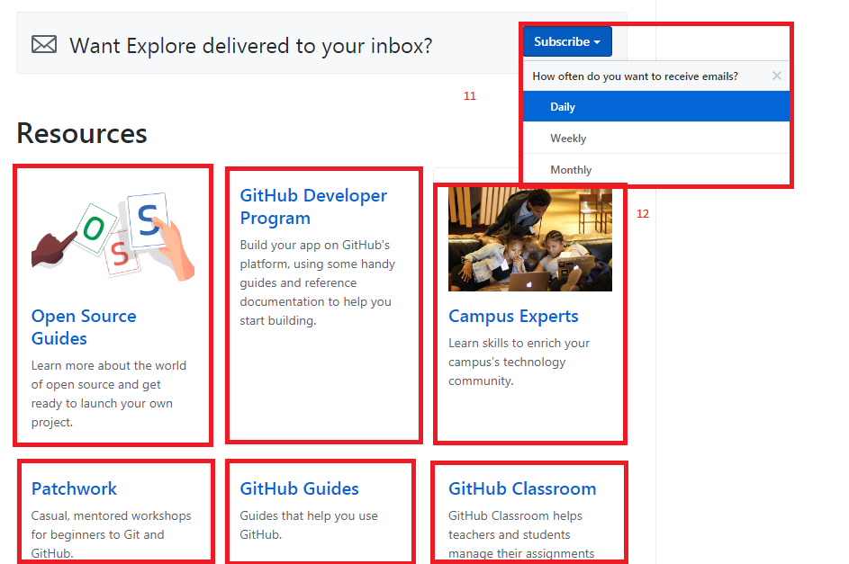
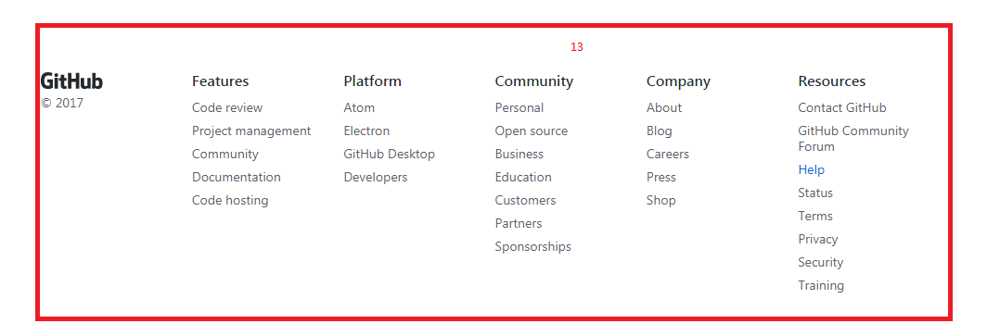
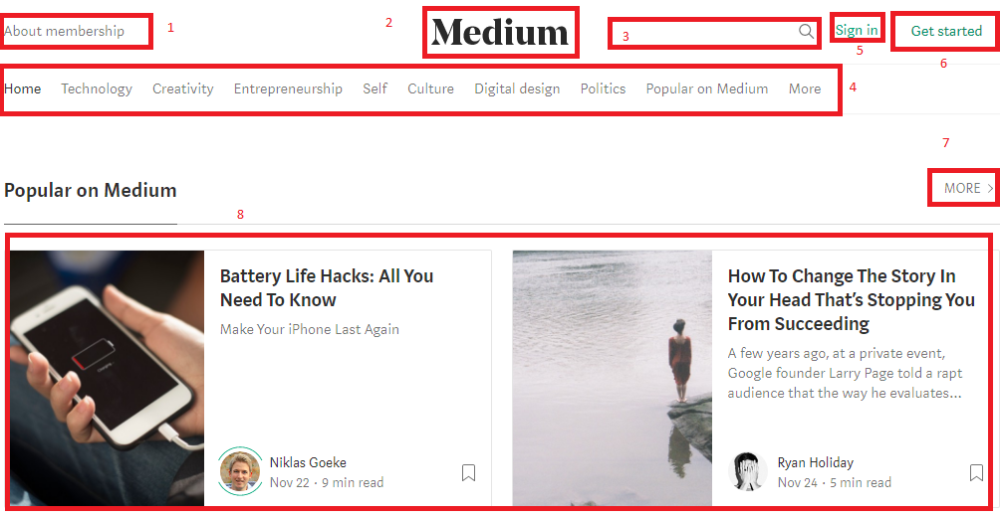
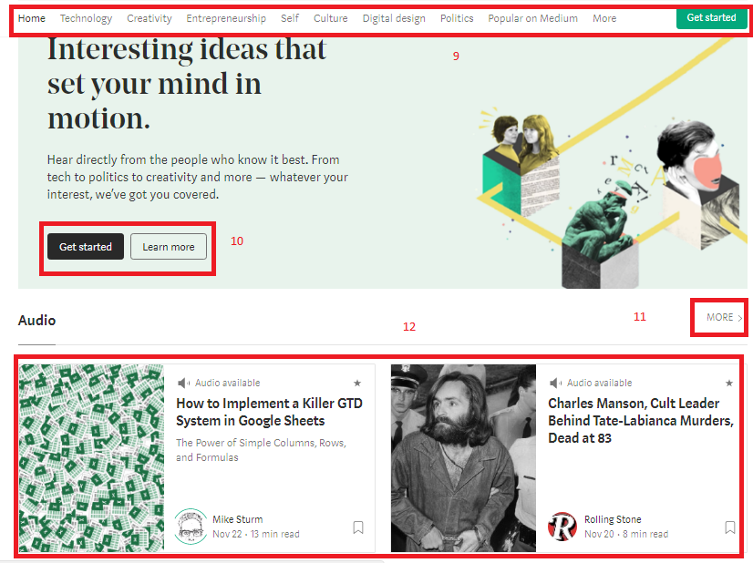

# Identificando tipos de navegación

**Curso: Creando un sitio web interactivo con JavaScript**  

**Unidad:  Unidad 3: Intro a User Experience Design**

***

* El reto consiste en:

   Identificar los elementos de navegación en los siguientes sites: 

 * Breather
 * Github
 * Medium

## Breather

1. Navegación Global.  

2. Local.  

3. Local.  

4. En línea.

5. Local.

6. En línea. 

7. Local.

8. Local. 

9. Faceteada.  

10. Local.

11. Faceteada.  

## GitHub

1. Suplementaria.  

2. Global.  

3. Local. 

4. Faceteada  y en línea.
   Porque me dan esas opciones para navegar pero estan puestos como enlaces.

5. Local.

6. En línea.

7. En línea y local. Porque está puesto como un enlace que me lleva a otra página.

8. Local.

9. Local.

10. Faceteada.  

11. Faceteada.

12. Local y Faceteada.
    Porque me dan esas opcines para navegar y ellas me llevan a otras páginas.

13. Faceteada. 

## Medium

1. Local.

2. Local.

3. Suplementaria. 

4. Global y faceteada. Me dan opciones en donde navegar y se mantienen en toda la navegación.

5. En línea y local. Esta opción de navegación esta sola y me lleva a otra ventana.

6. En línea y local. Esta opción de navegación esta sola y me lleva a otra ventana.

7. En línea. 

8. Faceteada y local. Me dan esas opciones para navegar y cada una me lleva a una ventana diferente. 

9. Global y faceteada. Me dan opciones en donde navegar y se mantienen en toda la navegación.

10. En línea y local. Esta opción de navegación esta sola y me lleva a otra ventana.

11.  En línea.

12. Faceteada y local. Me dan esas opciones para navegar y cada una me lleva a una ventana diferente. 

 