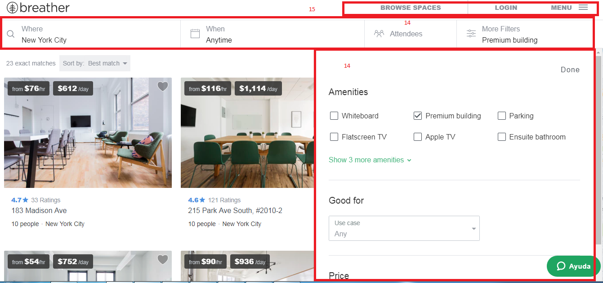

# Identificando tipos de navegación

**Curso: Creando un sitio web interactivo con JavaScript**  

**Unidad:  Unidad 3: Intro a User Experience Design**

***

* El reto consiste en:

   Identificar los elementos de navegación en los siguientes sites: 

 * Breather
 * Github
 * Medium

## Breather

1. Navegación Global.  

2. Local.  

3. Local.  

4. En línea.

5. Local.

6. En línea. 

7. Local.

8. Local. 

9. Faceteada

 